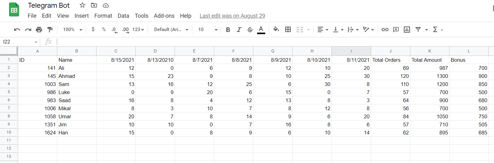

# Telegram Bot connected with Google Spreadsheet

It is used to retrive information from the google spreadsheet through an ID# sent to the bot and the displays the information in the form of the message

## Description

In this examlple, it is used by drivers working on an on-demand delivery in a company and each driver has their own id number. When the Id is sent to the telegram bot it displays their weekly orders deliverd, income, and bonus.

## Google Spreadsheet Example 

## Getting Started

### Creating Telegram Bot

* Download Telegram or use the Telegram web version (https://telegram.org/)
* Search for BotFather in the search bar and click on it
* Create a new bot by sending /newbot to the BotFather
* Choose a name and username for the bot
* Copy the token generated by the BotFather 

### Connecting Google SpreadSheet to Telegram Bot

* Create a new Spreadsheet 
* Go to tools > script editor
* Paste the code into the file and modify it if you want any changes
* Fill in the token field with the token generated by the BotFather
* Deploy the app and copy the url code 
* Fill the webappUrll with the copied url code
* Run GetMe() funtion
* Run SetWebhook() function

## Acknowledgments

code snippets
* [MeneerOom](https://github.com/MeneerOom/Connect-Telegram-Bot-to-Google-Sheets)
